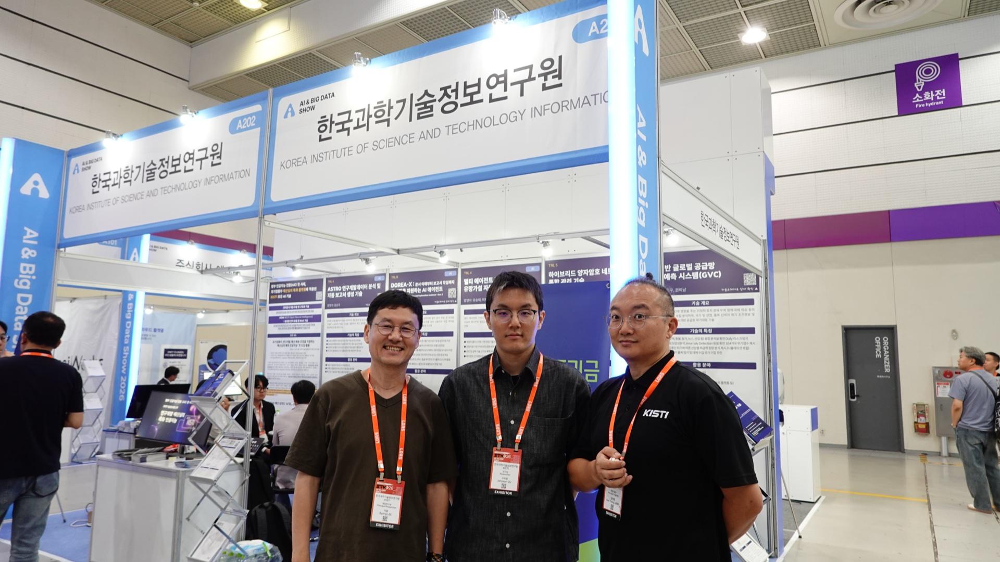
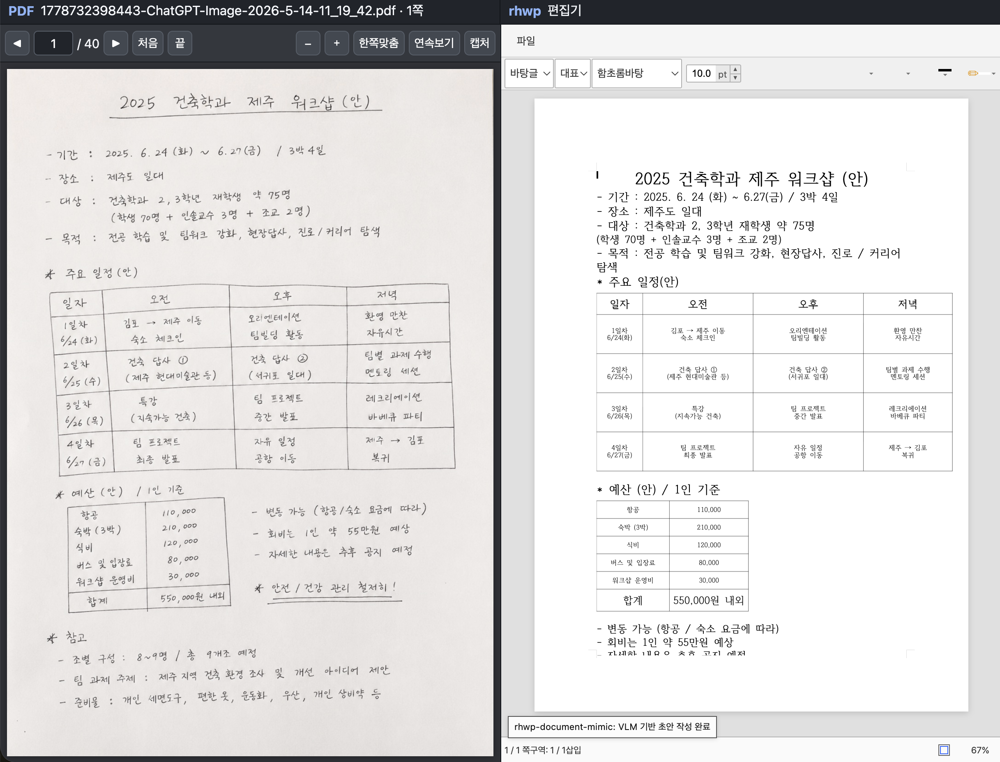

# 🌌 KISTI-NTIS BLUESKY

[한국어](README.md) | **English**

> **BLUESKY: Harmonizing Human and AI Collaboration**

---

## 🆕 Latest News

> ### 🎪 ${\color{gray}\textsf{DOREA-X exhibited at Smart Tech Korea 2026 — wrapped up!}}$
>
> DOREA-X was successfully exhibited at the **KISTI booth** at [Smart Tech Korea 2026 (STK 2026)](https://smarttechkorea.com/),
> held at **COEX, Seoul, June 10–12, 2026**. Thanks to everyone who stopped by! 🙏
>
> 📑 **[View the exhibition brochure (PDF)](assets/STK2026_DOREA-X_brochure.pdf)**

  

> ### 🎉 ${\color{red}\textsf{NELLA Distribution Released!}}$
>
> The **distribution of NELLA** — an Agentic LLMOps agent that builds the model for you once you give it documents — is now publicly available.
> With Docker installed, just `clone` and run `docker compose up -d --build` — **a few commands run it locally right away**.
>
> ➡️ **[Go to NELLA](https://github.com/leeryong/NELLA/blob/main/README.en.md)**

> ### 🎉 ${\color{red}\textsf{DOREA-X Distribution (DOREA-XP) Released!}}$
>
> A **distribution** packaging the core features of DOREA-X so anyone in research, education, or everyday work can download and use it directly.
> With Docker installed, a single line — `./install/install.sh` — **completes the installation**.
>
> ➡️ **[Go to DOREA-XP](https://github.com/leeryong/DOREA-X/tree/main/DOREA-XP)**

- **[ParserTry](https://github.com/leeryong/ParserTry/blob/main/README_Eng.md)** — A tool to instantly run and compare 21+ PDF parsers in a web UI. Run text/ML/OCR/VLM parsers on one screen and see for yourself which parser best fits your documents.
- **[Scarlet](https://github.com/leeryong/Scarlet/blob/main/README.en.md)** — A multi-agent knowledge exploration and reasoning system that autonomously explores and organizes diverse documents and data, then answers with evidence-based reasoning. Like the Holmes–Watson duo in *A Study in Scarlet*, Watson builds the knowledge base and Holmes reasons over the evidence to answer.
- **[rhwp Agent Skills](https://github.com/leeryong/rhwp-Agent-Skills_by_BLUESKY/blob/main/README.en.md)** — Skillifying Korean documents (HWP/HWPX) so AI agents can handle them directly. Agents recognize handwritten documents and author them in rhwp; we are developing **rhwp-Agent**, where humans and agents write together.

---

## 📑 Technologies · Systems Index

| Technology · System | Description |
| --- | --- |
| 🗂️ **[ParserTry](https://github.com/leeryong/ParserTry/blob/main/README_Eng.md)** · NEW | Local web app to instantly run and compare 21+ PDF parsers |
| 🎩 **[Scarlet](https://github.com/leeryong/Scarlet/blob/main/README.en.md)** | Multi-agent knowledge exploration and reasoning system (Holmes–Watson) |
| ✍️ **[rhwp Agent Skills](https://github.com/leeryong/rhwp-Agent-Skills_by_BLUESKY/blob/main/README.en.md)** | Skills letting AI agents handle Korean documents (HWP/HWPX) |
| 🛠️ **[NELLA](https://github.com/leeryong/NELLA/blob/main/README.en.md)** | An Agentic LLMOps **agent** that automates the entire domain-specialized LLM building process |
| 📄 **[DOREA-X](https://github.com/leeryong/DOREA-X/blob/main/README.en.md)** | A document-centric AI agent for document understanding, analysis, and report writing |

---

# 🤖 ARTWORK

## 🗂️ **ParserTry** &nbsp;· NEW

  

  <a href="https://github.com/leeryong/ParserTry/blob/main/README_Eng.md"><b>🔗 Go to ParserTry</b></a>

**ParserTry** is a local web app that **instantly runs and compares 21+ PDF parsers in a web UI**. No single parser is best for every PDF — before building a RAG pipeline, you can see for yourself which parser best fits your documents.

Key features:

- 🗂️ **21+ parsers supported** — text (PyMuPDF, pdfplumber, etc.), ML layout (Docling, MinerU, Marker), OCR (PaddleOCR, EasyOCR), VLM (Claude, GPT, Gemini, Ollama)
- 📄 **Document viewer + overlay** — displays parser-recognized elements as colored boxes over the original PDF, side by side
- 💡 **Parser recommendation analysis** — automatically analyzes document characteristics (text layer, images, tables, language) and ranks parsers by suitability
- 📊 **Measurement-based comparison table** — direct measurements on 4 sample documents, with a quality × processing-speed scatter plot
- ⚙️ **Extensible structure** — keep adding new parsers, run instantly with a single `python run.py`

---

## 🎩 **Scarlet**

  

  <a href="https://github.com/leeryong/Scarlet/blob/main/README.en.md"><b>🔗 Go to Scarlet</b></a>

**Scarlet** is a **multi-agent knowledge exploration and reasoning system** that autonomously explores and organizes diverse documents and data, then generates answers through evidence-based reasoning. Inspired by the Holmes–Watson duo in Conan Doyle's *A Study in Scarlet*, two agents divide roles and collaborate — **Watson organizes, Holmes reasons.**

Key features:

- 🩺 **Watson** — collects, parses, and structures diverse documents and data to build a knowledge base (Watson Journal)
- 🎩 **Holmes** — searches for evidence in the Watson Journal and generates trustworthy answers through multi-step reasoning
- 💬 The user, Holmes, and Watson converse together, presenting evidence and the reasoning trace
- 🔌 Integrates with multiple LLMs (Claude, OpenAI, Ollama) and various data stores (VectorDB, DB, search engines, MCP, etc.)

---

## ✍️ **rhwp Agent Skills**

  

  <a href="https://github.com/leeryong/rhwp-Agent-Skills_by_BLUESKY/blob/main/README.en.md"><b>🔗 Go to rhwp Agent Skills</b></a>

**rhwp Agent Skills** is a collection that **skillifies** the Korean document (HWP/HWPX) editor [rhwp](https://github.com/edwardkim/rhwp) so AI agents can handle it directly. As shown above, an agent recognizes a handwritten source and uses these skills to author it as an rhwp document.

Key features:

- 🧩 Organizes rhwp editing capabilities (characters/paragraphs/tables/shapes, page settings, etc.) into skills agents can invoke
- 🖥️ Directly manipulates and verifies the rhwp editor GUI via the `?agent=1` automation bridge
- ✍️ Developing a system (**rhwp-Agent**) where humans and agents write documents together

---

## 🛠️ **NELLA**

<a href="https://github.com/leeryong/NELLA/blob/main/README.en.md"><b>🔗 Go to NELLA</b></a>

**NELLA** (Nifty-Enhanced LLMOps Agent) is a new extension project following DOREA-X. Building on the experience of document-based intelligent agents, it is an **Agentic LLMOps agent that automates the entire domain-specialized LLM building process**.

While DOREA-X is a document-centric AI agent supporting document understanding, analysis, and report writing, NELLA aims at **full-lifecycle automation of LLM development** — from training-data generation, model selection, and fine-tuning to evaluation and chat testing, all based on documents.

Key features:

* Automatically generates SFT/DPO training data from uploaded documents alone
* Requests model building and controls progress through natural-language conversation
* Supports base-model recommendation, LoRA/QLoRA training, and automated evaluation
* Balances automation and user control through a Human-in-the-Loop design
* Supports building domain-specialized LLMs based on an organization's internal documents

---

## 📄 **DOREA-X**

  

  <a href="https://github.com/leeryong/DOREA-X/blob/main/README.en.md"><b>🔗 Go to DOREA-X</b></a>

**DOREA-X** (Document-Oriented Reasoning and Explanation Assistant) is a **document-centric AI agent system** that supports the entire process from document understanding to analysis and report writing.

Key features:
- 📄 Understands complex document structures such as PDFs and office documents  
- 🧠 Document-based question answering and reasoning-centered interaction  
- ✍️ Supports report writing and knowledge organization  

Beyond simple search,  
it aims for **a collaborative environment that deeply understands documents and thinks together with AI**.

---

## 🚀 About BLUESKY

**BLUESKY** is a space for exploring the harmonious collaboration of humans and AI. It aims to explore the latest AI technologies and **develop them into practical tools and methodologies** that can be applied to research support, knowledge discovery, and real-world problem solving.

This repository is an open space for:

- Experimenting with the latest AI paradigms  
- Designing intelligent agents that support research work  
- Exploring new ways of use that expand human creativity and productivity  

---

## 🔄 Latest Direction

BLUESKY continues to expand based on the experience of DOREA-X,  
and is currently evolving in the following directions:

- Autonomous and adaptive AI agents  
- AI systems tightly integrated with human workflows  
- Scalable architectures for research and knowledge platforms  

This repository is **a living space that reflects the latest updates, experiments, and ideas**.

---

## 🌱 Vision

> **A testing ground for exploring the latest AI technologies,  
> a platform that supports research,  
> and a living laboratory for attempting innovative AI applications**

---

## 📞 Contact

- Ryong Lee, KISTI-NTIS — ryonglee@kisti.re.kr
